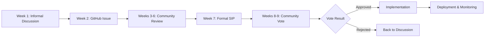

# SubStream Protocol Governance

## Overview

SubStream Protocol is a **community-governed decentralized protocol**. This document outlines how community members can propose new features, suggest improvements, and participate in decisions about the protocol's fee structure and future development.

## Governance Philosophy

We believe in:
- 🏛️ **Decentralized Decision-Making**: The community that uses the protocol should guide its evolution
- 💡 **Open Innovation**: Anyone can propose ideas, regardless of technical background
- 🤝 **Transparent Process**: All proposals and decisions are publicly documented
- ⚖️ **Fair Representation**: Stakeholders (creators, fans, developers) have balanced input
- 🚀 **Progressive Decentralization**: Gradually increasing community control over time

---

## Governance Structure

### 1. Community Members
Anyone can participate by:
- Discussing proposals in forums/Discord
- Providing feedback on GitHub issues
- Testing new features
- Spreading awareness

### 2. Active Contributors
Community members who:
- Have made code contributions
- Written documentation or tutorials
- Helped moderate community channels
- Organized events or workshops

### 3. Core Team
Maintains the protocol and:
- Reviews proposals for feasibility
- Implements approved changes
- Ensures security and stability
- Facilitates governance processes

### 4. Token Holders (Future)
Once governance tokens are launched:
- Vote on major protocol changes
- Elect community representatives
- Decide on treasury allocations
- Approve fee structure changes

---

## How to Propose a New Feature

### Step 1: Informal Discussion (Week 1)

**Where**: Discord #governance channel or community forum

**What to do**:
1. Share your idea in plain language
2. Explain the problem it solves
3. Ask for initial feedback
4. Identify potential concerns

**Template**:
```
📢 Idea: [Brief name for your feature]

Problem:
[What problem does this solve?]

Proposed Solution:
[How does your feature work?]

Benefits:
- Benefit 1
- Benefit 2

Potential Concerns:
[What challenges might this face?]

Questions for the Community:
[What do you want to know from others?]
```

### Step 2: Create GitHub Issue (Week 2)

**Where**: [GitHub Issues](https://github.com/your-org/SubStream-Protocol-Contracts/issues)

**What to include**:

#### Feature Request Template

```markdown
---
name: Feature Request
about: Suggest a new feature for SubStream Protocol
title: '[FEATURE] Brief description'
labels: ['enhancement', 'community-proposal']
assignees: ''
---

## Problem Statement
What problem are you trying to solve? Who experiences this problem?

## Proposed Solution
Describe how your feature would work. Be as specific as possible.

## Use Cases
Provide concrete examples of how this would be used:
- Creator scenario: ...
- Fan scenario: ...
- Developer scenario: ...

## Technical Considerations
- What contracts would need to change?
- Are there security implications?
- How does this affect existing users?

## Alternatives Considered
What other approaches did you consider? Why is this better?

## Implementation Feasibility
- [ ] Simple (minor changes to existing code)
- [ ] Moderate (new features, no breaking changes)
- [ ] Complex (major architectural changes)
- [ ] Breaking (requires migration path)

## Community Support
Link to discussions where community members have expressed support:
- Discord discussion: [link]
- Forum thread: [link]

## Additional Context
Any other information, mockups, or examples that would help understand the proposal.
```

### Step 3: Community Review Period (Weeks 3-6)

**What happens**:
- Core team reviews the proposal
- Community provides feedback
- Proposal author refines the idea
- Technical feasibility assessment

**Feedback Guidelines**:
- ✅ Be constructive and specific
- ✅ Focus on trade-offs, not just opinions
- ✅ Consider different stakeholder perspectives
- ✅ Think about long-term implications
- ❌ Avoid personal attacks or dismissive comments

### Step 4: Formal Proposal - SIP (Week 7)

If there's community interest, create a **SubStream Improvement Proposal (SIP)**.

**SIP Template**:

```markdown
---
sip: <number>
title: <SIP title>
author: <author names and contacts>
type: <Standard | Informational | Governance>
status: Draft
created: <date created>
discussions-to: <GitHub issue or forum link>
requires: <list of SIP numbers this depends on>
replaces: <list of SIP numbers this replaces>
---

## Abstract
One-paragraph summary of what this SIP proposes.

## Motivation
Why is this proposal important? What problem does it solve?

## Specification
Technical details of the proposed change:
- Contract modifications
- New functions or parameters
- State machine changes
- Interface updates

## Rationale
Why was this particular approach chosen?
Discuss alternatives that were considered and rejected.

## Backwards Compatibility
How does this affect existing users and contracts?
Are migrations needed?

## Test Cases
How will this be tested?
What are the edge cases?

## Security Considerations
What are the security implications?
How are risks mitigated?

## Implementation Plan
Phase 1: [Description and timeline]
Phase 2: [Description and timeline]
Phase 3: [Description and timeline]

## Costs
Estimated development and deployment costs.

## References
Links to relevant research, prior art, or discussions.
```

### Step 5: Community Vote (Week 8-9)

**Voting Process**:
1. **Announcement**: 2-week notice before voting begins
2. **Discussion Period**: Community debates pros/cons
3. **Voting Window**: 7 days for token holders to vote
4. **Execution**: If approved, implementation begins

**Voting Options**:
- ✅ For
- ❌ Against
- 🤷 Abstain

**Quorum Requirements**:
- Minimum 10% of token holders must participate
- Simple majority (>50%) wins
- For critical changes: supermajority (>66%) required

---

## Fee Structure Governance

### Current Fee Model

SubStream currently has **minimal network fees** that go to Stellar validators:

| Action | Current Fee | Recipient |
|--------|-------------|-----------|
| Subscribe | ~0.0026 XLM | Validators |
| Collect | ~0.0021 XLM | Validators |
| Cancel | ~0.0018 XLM | Validators |
| Top Up | ~0.0015 XLM | Validators |

**Protocol Fees**: Currently **0%** (no platform fees)

### Proposing Fee Changes

Fee changes require **supermajority approval** (>66% of votes).

**Required Information in Fee Change Proposal**:

1. **Current Fee Analysis**
   - Current fee rates
   - Impact on users (with data)
   - Comparison to competitors

2. **Proposed Fee Structure**
   - New fee rates
   - Which actions are affected
   - Implementation timeline

3. **Economic Impact**
   - Projected revenue impact
   - User behavior predictions
   - Competitiveness analysis

4. **Fee Distribution**
   - Where do fees go? (treasury, buyback, rewards)
   - Transparency mechanisms
   - Allocation percentages

5. **Mitigation Measures**
   - Hardships for existing users
   - Phase-in period
   - Exemptions or discounts

### Fee Change Example

```markdown
## Proposal: Protocol Fee Introduction

### Current State
- Protocol fees: 0%
- Network fees only: ~0.002 XLM per transaction

### Proposed Changes
- Introduce 0.5% fee on collected earnings
- Fees deducted at collection time
- No changes to subscription or cancellation

### Fee Allocation
- 40%: Protocol treasury (development fund)
- 30%: Token holder rewards (staking pool)
- 20%: Community grants (ecosystem growth)
- 10%: Emergency reserve (security buffer)

### Impact Analysis
Creator earning 100 XLM/month:
- Current: receives 100 XLM
- Proposed: receives 99.5 XLM (0.5 XLM fee)
- Equivalent to ~$0.025 USD at current rates

### Use of Funds
Quarterly transparency reports will show:
- Treasury balance and allocations
- Grant recipients and amounts
- Development milestones achieved
- Token reward distributions

### Implementation Timeline
- Month 1: Announcement and education
- Month 2: Technical implementation
- Month 3: Gradual rollout (0.1%, 0.3%, 0.5%)
- Month 4: Full implementation

### Exemptions
- Creators earning <10 XLM/month: exempt for first year
- Educational institutions: 50% discount
- Non-profit organizations: case-by-case review
```

---

## Voting Mechanisms

### On-Chain Voting (Future)

Implemented via governance token smart contracts:

```solidity
// Example governance contract interface
interface ISubStreamGovernance {
    function propose(address target, bytes calldata data, string calldata description) external returns (uint);
    function vote(uint proposalId, bool support) external;
    function execute(uint proposalId) external;
    function quorumVotes() external view returns (uint);
}
```

### Off-Chain Signaling

Currently using:
- **Snapshot.org**: Gasless voting with signed messages
- **Discord Polls**: Quick community sentiment checks
- **GitHub Reactions**: Thumbs up/down on proposals

### Delegation

Token holders can delegate voting power to:
- Trusted community members
- Subject matter experts
- Active contributors

Delegation is revocable at any time.

---

## Governance Timeline



---

## Types of Proposals

### Standard Track
Technical changes that affect protocol functionality.
- Examples: New features, contract upgrades, parameter changes

### Informational Track
Documentation, guidelines, or best practices.
- Examples: Coding standards, security guidelines, tutorials

### Governance Track
Changes to the governance process itself.
- Examples: Voting rules, quorum requirements, proposal thresholds

---

## Creator Profile Metadata Standard

To ensure interoperability between different frontends and applications building on the SubStream Protocol, we propose a standardized JSON schema for creator profiles. This metadata should be stored off-chain (e.g., on IPFS), and the Content Identifier (CID) should be linked to the creator's on-chain profile using the `set_profile_cid` function.

This standard is proposed under the **Informational Track** and helps fulfill the requirements of Issue #46 (Multi-Language Metadata) and #50 (Standardizing Creator CIDs).

### Schema Definition (Version 1.0)

```json
{
  "$schema": "http://json-schema.org/draft-07/schema#",
  "title": "SubStream Creator Profile",
  "description": "Standard metadata for a SubStream creator profile.",
  "type": "object",
  "properties": {
    "name": {
      "description": "The display name of the creator.",
      "type": "string"
    },
    "bio": {
      "description": "A short biography of the creator.",
      "type": "string"
    },
    "image": {
      "description": "A URL (preferably IPFS) to the creator's profile picture.",
      "type": "string",
      "format": "uri"
    },
    "socials": {
      "description": "Links to social media profiles.",
      "type": "object",
      "properties": {
        "twitter": { "type": "string" },
        "youtube": { "type": "string" },
        "website": { "type": "string", "format": "uri" }
      }
    },
    "i18n": {
      "description": "Internationalization object for localized text, using language codes.",
      "type": "object",
      "patternProperties": {
        "^[a-z]{2}(-[A-Z]{2})?$": {
          "type": "object",
          "properties": {
            "name": { "type": "string" },
            "bio": { "type": "string" }
          }
        }
      }
    }
  },
  "required": ["name"]
}
```

### Example

```json
{
  "name": "Cooking with Sarah",
  "bio": "Exploring the world's cuisines, one dish at a time. Join my stream for exclusive recipes and live cooking sessions!",
  "image": "ipfs://bafybeigv4vj3gblj6f27bm2i467p722m35ub22qalyk2sfyvj2f2j2j2j2",
  "socials": {
    "twitter": "CookWithSarah",
    "youtube": "CookingWithSarahChannel"
  },
  "i18n": {
    "es": {
      "name": "Cocinando con Sarah",
      "bio": "Explorando las cocinas del mundo, un plato a la vez. ¡Únete a mi stream para recetas exclusivas y sesiones de cocina en vivo!"
    },
    "fr": {
      "name": "Cuisiner avec Sarah",
      "bio": "Explorer les cuisines du monde, un plat à la fois. Rejoignez mon stream pour des recettes exclusives et des sessions de cuisine en direct !"
    }
  }
}
```

---

## Proposal Lifecycle States

```
Draft → Under Review → Community Discussion → Voting → Approved/Rejected → Implemented
```

**State Descriptions**:

- **Draft**: Initial proposal submitted
- **Under Review**: Core team assessing feasibility
- **Community Discussion**: Open for public feedback
- **Voting**: Active voting period
- **Approved**: Passed vote, ready for implementation
- **Rejected**: Failed vote or withdrawn by author
- **Implemented**: Successfully deployed to mainnet

---

## Emergency Governance

For critical security issues or bugs:

### Emergency Response Process

1. **Disclosure**: Report privately to security@substream-protocol.com
2. **Assessment**: Core team evaluates severity within 24 hours
3. **Temporary Pause**: May pause affected features if critical
4. **Fix Development**: Rapid development of patch
5. **Expedited Vote**: 48-hour voting window for emergency measures
6. **Deployment**: Immediate deployment upon approval
7. **Post-Mortem**: Public report within 7 days

### Emergency Powers

Core team retains ability to:
- Pause protocol functions temporarily (max 7 days)
- Deploy critical security fixes without full vote
- Freeze suspicious activity pending investigation

These powers require **multi-sig approval** (3 of 5 core team members) and must be reported to community within 24 hours.

---

## Treasury Management (Future)

### Treasury Sources

- Protocol fees
- Grants and donations
- Investment returns
- Partnership revenues

### Treasury Allocation

Proposed allocation (subject to governance vote):

```
┌─────────────────────────────────────┐
│  Treasury Allocation                │
├─────────────────────────────────────┤
│  Development Fund       40%        │
│  Community Grants       25%        │
│  Token Rewards          20%        │
│  Operations             10%        │
│  Emergency Reserve       5%        │
└─────────────────────────────────────┘
```

### Grant Programs

**Types of Grants**:
- 🛠️ **Developer Grants**: Building tools and integrations ($5k-$50k)
- 📚 **Education Grants**: Creating tutorials and documentation ($1k-$10k)
- 🌍 **Ecosystem Grants**: Growing adoption in new regions ($10k-$100k)
- 🔒 **Security Grants**: Audits and bug bounties ($10k-$200k)

**Grant Application Process**:
1. Submit application via GitHub
2. Grants committee reviews bi-weekly
3. Approved grants announced publicly
4. Milestone-based disbursement
5. Progress reports required

---

## Community Roles

### Moderators
Volunteers who:
- Keep discussions productive
- Enforce code of conduct
- Highlight important discussions
- Welcome newcomers

### Ambassadors
Community leaders who:
- Represent SubStream at events
- Create content in their regions
- Provide local language support
- Gather community feedback

### Technical Advisors
Experts who:
- Review technical proposals
- Assess security implications
- Advise on implementation complexity
- Conduct code reviews

---

## Communication Channels

### Primary Channels
- **Discord**: Real-time chat and quick polls
- **GitHub**: Formal proposals and technical discussions
- **Forum**: Long-form discussions and announcements

### Secondary Channels
- **Twitter/X**: Announcements and community updates
- **Telegram**: Regional community groups
- **Reddit**: Community discussions and AMAs
- **YouTube**: Governance meeting recordings

### Monthly Community Call
- Last Thursday of every month
- Open to all community members
- Recording posted to YouTube
- Agenda published 1 week in advance

**Typical Agenda**:
1. Core team updates (15 min)
2. Active proposal reviews (30 min)
3. Community Q&A (30 min)
4. Breakout discussions (30 min)

---

## Conflict Resolution

### Dispute Escalation Process

**Level 1**: Direct discussion between parties
**Level 2**: Moderator mediation
**Level 3**: Community council arbitration
**Level 4**: Formal governance vote

### Code of Conduct

All participants must:
- Be respectful and inclusive
- Focus on ideas, not personalities
- Assume good faith
- Accept constructive criticism
- Apologize when mistakes are made

Violations may result in temporary or permanent removal from governance participation.

---

## Transparency & Accountability

### Public Records

All governance activities are documented:
- Proposal history on GitHub
- Voting results on Snapshot
- Meeting recordings on YouTube
- Treasury transactions on-chain

### Quarterly Reports

Core team publishes:
- Development progress
- Financial statements
- Community growth metrics
- Upcoming roadmap

### Annual Governance Review

Once per year, the community:
- Evaluates governance effectiveness
- Proposes process improvements
- Elects new council members (if applicable)
- Sets strategic priorities for next year

---

## Getting Started

### For Newcomers

1. **Join Discord**: Introduce yourself in #welcome
2. **Read Documentation**: Understand the protocol
3. **Participate in Discussions**: Share your perspective
4. **Start Small**: Comment on existing proposals
5. **Submit Your First Proposal**: When ready!

### For Active Contributors

1. **Review Open Issues**: Find problems to solve
2. **Join Working Groups**: Collaborate on specific areas
3. **Mentor Newcomers**: Help others get involved
4. **Run for Council**: If governance tokens exist

### Checklist Before Submitting Proposal

- [ ] I've searched for similar proposals
- [ ] I've discussed this informally in Discord
- [ ] I've identified the problem clearly
- [ ] I've considered alternative solutions
- [ ] I've assessed technical feasibility
- [ ] I've estimated costs and timeline
- [ ] I've gathered initial community feedback
- [ ] I'm available for follow-up questions

---

## FAQ

**Q: Do I need tokens to participate?**
A: No! You can participate in discussions, provide feedback, and even submit proposals without tokens. Voting may require tokens in the future.

**Q: How long does the governance process take?**
A: Typically 8-9 weeks from idea to decision, but emergency proposals can be expedited.

**Q: What if my proposal is rejected?**
A: You can revise based on feedback and resubmit, or accept the community's decision. Many great ideas come from initially rejected proposals!

**Q: Can proposals be changed during voting?**
A: Minor clarifications are okay, but significant changes should restart the review period.

**Q: Who implements approved proposals?**
A: Either the core team (for critical changes) or community contributors (via grants program).

**Q: How are conflicts of interest handled?**
A: Proposers must disclose any conflicts. Affected parties may need to recuse themselves from voting.

**Q: Is governance legally binding?**
A: Governance decisions guide protocol development but may not have legal force. Consult legal counsel for specific concerns.

---

## Contact

**Questions about governance?**
- Discord: #governance channel
- Email: governance@substream-protocol.com
- Forum: governance.substream-protocol.com

**Security issues?**
- Email: security@substream-protocol.com (encrypted preferred)
- DO NOT discuss publicly until resolved

---

## License

This governance documentation is licensed under CC-BY-4.0 (Creative Commons Attribution 4.0 International).

You are free to share, adapt, and build upon this work, even commercially, as long as you give appropriate credit.

---

*Last updated: March 2026*
*Version: 1.0*
*Next review: June 2026*
